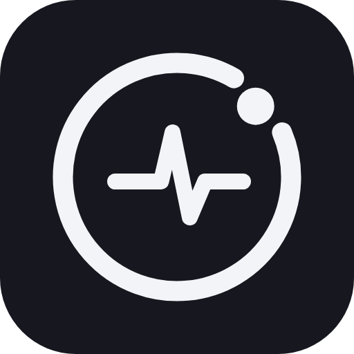
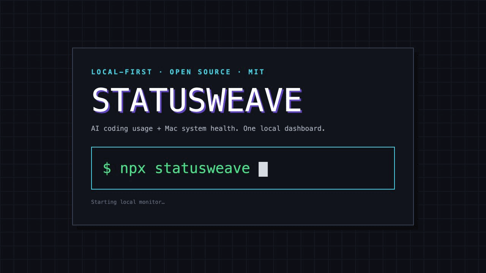

<div align="center">
  
  <h1>StatusWeave</h1>
  <p><strong>在一个本机面板里，看清 AI coding 用量和 Mac 系统状态。</strong></p>
  <p>MIT 开源 · 本地优先 · macOS</p>
  <p>
    
    
    
    
  </p>
  <p><a href="./README.md">English</a> · 中文</p>
</div>



_演示使用合成数据，不包含真实账号或用量。_

```bash
npx statusweave
```

就这一行。StatusWeave 会启动本地服务并自动打开 `http://127.0.0.1:8787`。Mac 系统监控开箱即用，不需要任何 AI 账号；不想自动打开浏览器时加 `--no-open`。

要求 macOS 和 Node.js 18+，运行时零依赖。

## 核心能力

- **AI coding 用量** —— 展示 Claude Code、Codex、Kimi 的套餐限额窗口和本地 token 统计；只读取你 Mac 上已经安装、登录并明确授权的 CLI
- **Mac 系统状态** —— 每核 CPU、内存、swap、磁盘、负载、Apple Silicon GPU、应用内存分布和 Top 进程
- **像素风 Dark / Light 面板** —— 默认跟随 macOS 外观，记住手动选择，支持中英文
- **本机只读 REST API** —— JSON 指标供 coding agent 和其他本地应用读取，默认只绑定 `127.0.0.1`
- **终端控制台** —— 交互式 TUI，另有单次快照、ASCII 和 JSON 模式

> **Provider 集成为非官方实现。** StatusWeave 与 Anthropic、OpenAI、Moonshot AI 无从属、背书或合作关系。可用性和准确度取决于各家当前的 CLI，可能随版本变化而失效，请勿据此做计费判断。

## 开启 AI 用量监控

系统监控无需设置。需要 AI 用量时，只授权你实际使用的 provider：

```bash
npx statusweave authorize claude,codex,kimi
npx statusweave
```

一次性设置会在可见终端中打开你选择的 CLI：

- **Claude Code** —— 输入 `/usage`，确认能看到用量，退出后回答 `y`
- **Kimi** —— 输入 `/status`，确认能看到用量，退出后回答 `y`
- **Codex** —— 结构化验证通过后自动完成

已有的 CLI 登录会直接复用。如果需要登录、MFA、账号选择、目录 Trust 或 `[y/N]` 确认，必须由你本人完成。授权完成后，以后启动会自动启用对应 provider。

```bash
npx statusweave authorize --status      # 查看设置状态
npx statusweave authorize --reset kimi  # 撤销同意，不会退出 Kimi
```

StatusWeave 不能用任意 API Key 查询会员额度，只支持文档中明确列出的 provider 和获取方式。

## 让 coding agent 协助安装

把下面这段粘贴给 Claude Code、Codex、Kimi 或其他 coding agent：

> 请从 https://github.com/IndexFziQ/statusweave 安装 StatusWeave。先阅读 AGENT_INSTALL.md，再按文档检查环境、执行 npm 安装、检测 Claude Code/Codex/Kimi、完成监控设置、启动并验证。已有的 CLI 登录直接复用；如果需要登录、MFA、账号选择、目录 Trust，或者终端出现 `[y/N]` 确认，必须停下来交给我本人操作，不要替我回答。不要在对话、日志或非官方域名中输出或上传凭据。完成后打开 http://127.0.0.1:8787，并报告每个受支持 provider 的真实状态。

Agent 可以检查环境、安装、启动和验证，但不能代你登录账号，也不能替你回答授权确认。

## 隐私边界

- **本地优先，无遥测。** 系统指标、本地用量历史和面板数据保留在你的 Mac 上。
- **AI provider 默认全部关闭。** 授权只保存权限受限的同意元数据，不保存密码、API Key、OAuth Token 或终端输出。
- **凭据限定去向。** Claude 和 Codex token 只发送到各自的服务端点；Kimi 状态通过本机已安装的 Kimi CLI 获取，遵循该 CLI 自身的正常联网行为。原始凭据不会从本地 API 返回。
- **默认只监听本机回环。** 服务绑定 `127.0.0.1`，拒绝非 loopback 的 Host 头，CORS 默认关闭。
- 数据流细节和漏洞报告方式见 [`SECURITY.md`](.github/SECURITY.md)。

## REST API

面板背后的同一份数据可直接给 agent 和本地应用使用：

```bash
curl -s http://127.0.0.1:8787/api/stats | jq .cpu.overall
curl -s http://127.0.0.1:8787/api/usage | jq '.providers[0].plan'
```

| 端点 | 内容 |
|---|---|
| `GET /api/stats` | CPU、内存、swap、磁盘、负载、进程、应用分布和 AI 用量 |
| `GET /api/usage` | 受支持的 AI provider 用量 |
| `GET /api/health` | 服务状态和已启用 provider |

## 其他运行方式

**全局安装**还会提供 `statusweave-cli` 终端控制台：

```bash
npm install -g statusweave
statusweave
statusweave-cli --once --json
```

**源码运行：**

```bash
git clone https://github.com/IndexFziQ/statusweave.git
cd statusweave
node src/statusweave.js
```

**浮动窗口 / DMG** 是面向 Apple 芯片的未签名 Beta 伴侣应用。它不会自己启动监控服务，并且可能被 Gatekeeper 拦截，因此仍推荐先使用 `npx statusweave`。

[下载 StatusWeave macOS 版（arm64，未签名 Beta）](https://github.com/IndexFziQ/statusweave/releases/latest/download/StatusWeave-macOS-arm64.dmg)

打开 App 前，请保持本机监控命令运行：

```bash
npx statusweave
```

然后挂载 DMG，把 `StatusWeave.app` 拖进“应用程序”并尝试打开。如果 macOS 拦截未签名 Beta，请进入 **系统设置 → 隐私与安全性**，选择 **仍要打开**。使用 Xcode Command Line Tools 从源码构建 App 和 DMG：

```bash
bash scripts/build-dmg.sh
```

## 停止和卸载

- `npx statusweave`：在启动它的终端中按 `Ctrl+C`。
- 全局安装：停止进程后运行 `npm uninstall -g statusweave`。
- 源码安装：停止进程后删除克隆目录。

可选的本机状态位于 `~/.statusweave/`，删除前请先确认内容。卸载不会退出任何 provider CLI；如需撤销监控同意，先运行 `statusweave authorize --reset <provider>`。

## 贡献

欢迎提交 Issue 和 Pull Request，详见 [`CONTRIBUTING.md`](.github/CONTRIBUTING.md)。安全问题请通过 [GitHub 私密漏洞报告](https://github.com/IndexFziQ/statusweave/security/advisories/new) 提交，不要开公开 Issue。

## 许可

[MIT](LICENSE)
